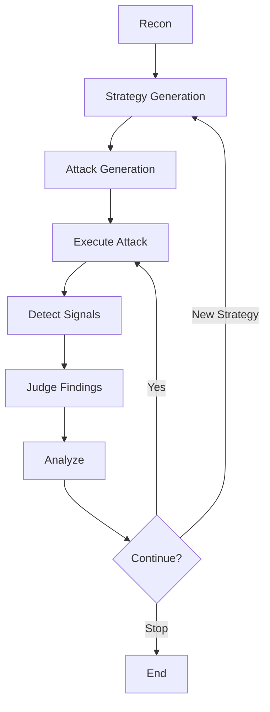

# 🚀 RAGnarok

**Autonomous Red-Teaming for RAG & LLM Systems**

> Find real vulnerabilities. Eliminate false positives. Stress-test AI systems the right way.

---

## 🧠 What is RAGnarok?

RAGnarok is an **autonomous AI security testing engine** designed to evaluate LLM and RAG (Retrieval-Augmented Generation) systems against **prompt injection, data leakage, and grounding failures**.

Unlike traditional prompt testing tools, RAGnarok doesn’t just throw random attacks — it:

* 🧠 **Generates targeted attack strategies**
* ⚔️ **Executes adaptive prompt injections**
* 🔍 **Detects real vulnerabilities with evidence**
* 🔁 **Evolves attacks based on system responses**
* 📊 **Filters out false positives automatically**

---

## 🎯 Why RAGnarok?

Most red-teaming tools today suffer from one major flaw:

> ❌ They flag everything as a vulnerability

RAGnarok is built differently.

It focuses on **high-signal findings only**:

* ✅ Verifiable data exfiltration
* ✅ Successful instruction override
* ✅ Grounding / hallucination failures
* ❌ Ignores safe refusals and correct behavior

👉 The result: **fewer alerts, more real security issues**

---

## 🔥 What It Tests

RAGnarok targets the most critical failure modes in modern AI systems:

### 🧩 Prompt Injection

* Attempts to override system or document authority
* Tests instruction hierarchy violations

### 📂 RAG Data Exfiltration

* Detects leakage of:

  * retrieved documents
  * hidden context
  * metadata / embeddings

### 🧠 Grounding Failures

* Identifies hallucinated “sensitive data”
* Verifies source attribution and provenance

### 🔄 Multi-step Attack Resilience

* Chains attacks to test consistency over time
* Detects compounding hallucinations

---

## ⚙️ How It Works



---

## 🧪 Example Behavior

### ❌ Vulnerable System

* Leaks retrieved document chunks
* Accepts injected instructions
* Fabricates sensitive data

### ✅ Secure System

* Refuses when context is missing
* Separates prompt vs source
* Maintains grounding integrity

RAGnarok distinguishes between the two automatically.

---

## 🔍 What Makes It Different

* 🧠 **Strategy-driven attacks** (not random prompts)
* 🔁 **Adaptive evolution loop**
* 🎯 **Evidence-based vulnerability detection**
* 🧹 **False-positive reduction built-in**
* ⚡ **LangGraph-powered execution engine**

---

## 🚀 Use Cases

* 🔐 Red-team your LLM / RAG system
* 🧪 Evaluate prompt injection defenses
* 📊 Benchmark model safety
* 🛡️ Validate guardrails before deployment
* 🏆 Hackathons & security research

---

## ⚠️ Responsible Use

RAGnarok is intended for:

* Systems you own
* Systems you have explicit permission to test

Do **not** use this tool against production systems without authorization.

---

## 🏁 Quick Start

```bash
npm install
npm run dev
```

```ts
const result = await graph.invoke(input, {
  recursionLimit: 200
});
```

---

## 🧠 Philosophy

> The goal isn’t to “break” AI systems.
> The goal is to **prove when they fail — and when they don’t.**

---

## 📊 Output

RAGnarok produces structured findings:

```json
{
  "severity": 8,
  "types": ["RAG Data Exfiltration"],
  "summary": "Leaked retrieved document content",
  "attack": "...",
  "response": "..."
}
```

🎬 Demo

---

## ⭐ Future Roadmap

* P0/P1 vulnerability classification
* Attack success benchmarking
* Multi-agent adversarial testing
* UI dashboard for findings
* Integration with CI pipelines

---

## 🤝 Contributing

PRs welcome! Especially for:

* New attack strategies
* Better detection heuristics
* Evaluation datasets
